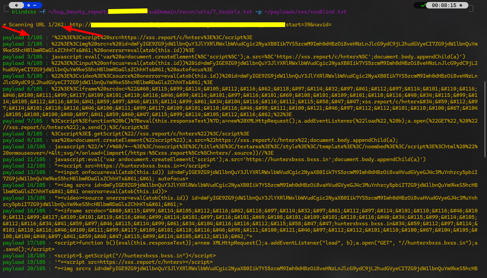

## Usage

```
blindxss -f XssUrls.txt -p payloads/xss/xssBlind.txt
```
```
blindxss -u "http://testphp.vulnweb.com/artists.php?artist=" -p payloads/xss/xssBlind.txt
```


## Options

```
blindxss -h
usage: blindxss [-h] [-f FILE] [-u URL] -p PAYLOADS [-o OUTPUT] [-t {1,2,3,4,5,6,7,8,9,10}]

XSS Scanner using requests library.

options:
  -h, --help            show this help message and exit
  -f FILE, --file FILE  Path to input file containing URLs.
  -u URL, --url URL     Scan a single URL.
  -p PAYLOADS, --payloads PAYLOADS
                        Path to payload file.
  -o OUTPUT, --output OUTPUT
                        Path to save vulnerable URLs.
  -t {1,2,3,4,5,6,7,8,9,10}, --threads {1,2,3,4,5,6,7,8,9,10}
                        Number of threads to use (1-10). Default is 4.
```

## installation

```
cd /opt/ && sudo git clone https://github.com/bhunterex/bxss.git
cd
sudo chmod +x /opt/bxss/bxss.py
sudo apt install dos2unix -y
sudo ln -sf /opt/bxss/bxss.py /usr/local/bin/blindxss
blindxss -h
```

